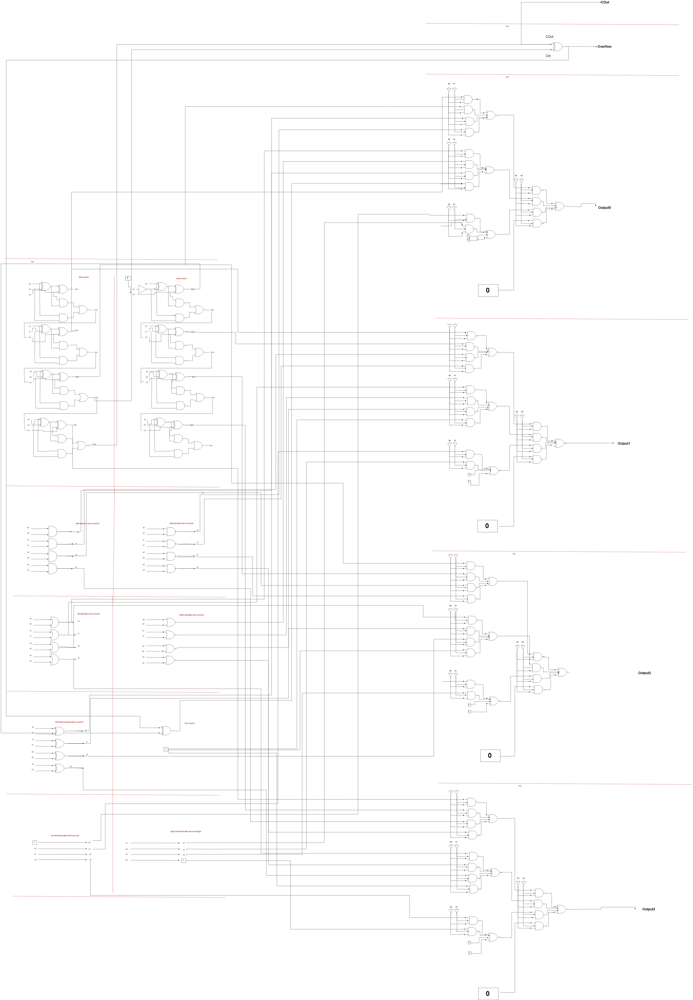
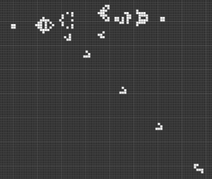

# Our Implementation

## ALU Design
The construction of our computational element, an Arithmetic Logic Unit, started with the creation of a block diagram. While we initially wanted our ALU to be able to perform all of the operations required by the MIPS architecture, we quickly pared this down to fit within the time constraints of the project. We settled on creating the frameworks associated with the ALU: addition, subtraction, logic gates, and a multiplexer.

However, to complete our exploration of the ALU, we created a complete gate-level diagram of a four-bit ALU - if we were to implement the entire system in the Game of Life, we would need to implement each piece individually. Because of the difficulty of tracing lines in the Game of Life, we did not complete all of the wiring necessary for complete ALU operation.



 In order to create the structures of a computer in the game of life, we have to implement physical structures to produce, relay, and modify information. Due to the underlying logic gate structure of computers, we could build almost any structure using a combination of logic gates, traces to connect gates, and "voltage sources" to drive the inputs for the logic gates.
 
## Analogues of Voltage Sources and Wiring
 In real-life systems, information is transmitted across computers through digital signals: a combination of high and low voltages read over time. This digital stream of 1s and 0s is emulated in the *Game of Life* by the presence or absence of gliders in a glider stream.

 The following image depicts a glider stream that is transmitting a stream of 1s.

 

 A lack of gliders would indicate a transmission of all 0s.

 

Due to the large propagation delay of logic gates relative to the amount of gliders that pass through them, each digital signal would have to contain on the order of 50 or more gliders to prevent any hazards.

In order to continually generate signals to pass through our hardware, we used the Gosper Glider Gun in combination with an eater block to control whether or not we were producing a glider stream.


## Logic Gates
The following logic gate structures were obtained from [nicolasloizeau](https://github.com/nicolasloizeau/gol-computer).

#### AND


#### XOR


#### NOR


#### OR


#### NOT


## Hazards
As a glider moves through the lattice, it oscillates between 4 phases. Structures that interact with gliders are very picky and will only couple properly if the glider stream comes into contact with structure at the right phase. Unfortunately, most actions that affect a stream will set the stream out of phase. To compensate for shifting phases, strategic delay blocks need to be added to keep traces in phase. 

If any traces need to overlap, they must be shifted out of phase or else the gliders will destructively interfere and propagate false 0s.

## Construction and Final Result
To run the *Game of Life* we used the open-source application Golly. The scripts included with Golly that placed the cells were written with quad trees that were incomprehensible to us, so we placed and routed our ALU by hand (this process certainly built character). To run scripts in Golly, install and launch the application:

```
sudo apt-get install golly

golly FILENAME.mc
```

By first building each individual component (add/sub module, mux, individual logic gates) we were able to use a bitwise architecture to simplify the building of our final product.

Below is a capture of the adder we built. We also created a multiplexer (granted, we did not complete wiring the traces) and a large set of utility files, including  combinations of gates, joints, and trifurcation/quadfurcation joints.


To continue this work, we would want to continue translating our block diagram to gates and traces in Golly. We could also more thoroughly explore scripting frameworks for determining inputs and for automating some of the tedious and error-prone effort of traving arrays.


## Reflection
Our work plan was highly inaccurate : we had budgeted twenty hours to completing the ALU design and operation, and it took us well over twenty hours to be able to create an adder and partial multiplexer. The reason for this delay was because of the difficulty associated with tracing paths for the gliders. This was especially painful because the labor of tracing the gliders was a tedious and frustrating operation with very little additional learning as we spent more time working on it.
